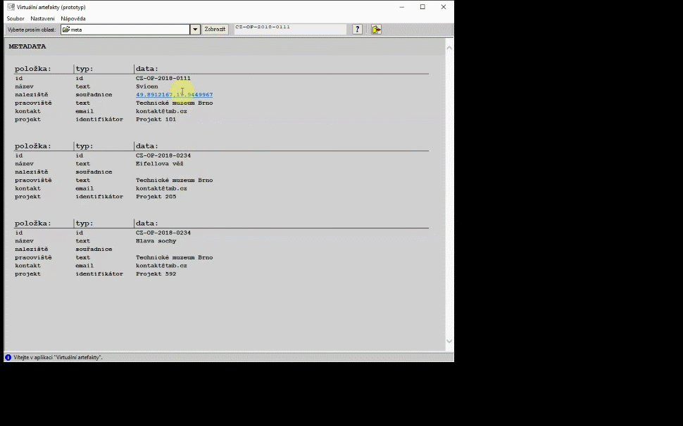

# Desktopová aplikace "3D Browser"
Jedná se o prototyp softwaru pro zobrazování virtuálních 3D artefaktů spolu s doprovodnými informacemi. Předpokladá se je jeho použití pro zobrazování expertních dat umístěných např. v existující databázi. Daná část informace je členěna do oblastí, a lze ji zobrazit po rozbalení rolovacího menu a kliknutí na oblast. Oblast zobrazuje buď stránku nebo 3D objekt a stránku. 3D objekt lze prohlížet pomocí otáčení a přibližování.
- 3D artefakty můžete otáčet a přibližovat.
- Lze měnit cestu ke cache paměti se zobrazovaným obsahem.
 

<h3><a href="mailto:vaclav.kolarcik@seznam.cz">► Pro bližší informace kontaktujte e-mailem ◄</a></h3>