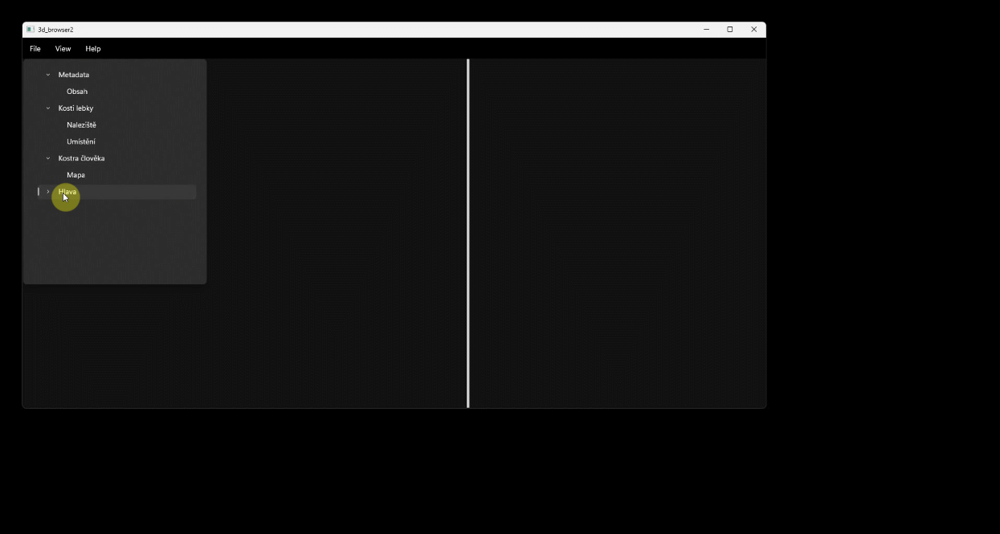

# Desktopová aplikace "3D Browser"
Jedná se o prototyp softwaru pro zobrazování virtuálních 3D artefaktů spolu s doprovodnými informacemi. Předpokladá se jeho použití pro zobrazování expertních dat umístěných např. v existující databázi. Dané informace jsou členěny do oblastí a lze je zobrazit po rozbalení rolovacího menu a kliknutím na oblast. Oblast zobrazuje buď stránku nebo 3D objekt a stránku. 3D objekt lze prohlížet pomocí otáčení a přibližování.
- 3D artefakty můžete otáčet a přibližovat.
- Lze měnit cestu ke cache paměti se zobrazovaným obsahem.
- Před spuštěním je nuto nainstalovat knihovny <a href="https://www.microsoft.com/en-us/download/details.aspx?id=8109">DirectX End-User Runtimes (June 2010)</a> a <a href="https://www.microsoft.com/en-us/download/details.aspx?id=26347">Microsoft Visual C++ 2005 Redistributable Package</a>
 

 

<h3><a href="mailto:vaclav.kolarcik@seznam.cz">► Pro bližší informace kontaktujte e-mailem ◄</a></h3>

